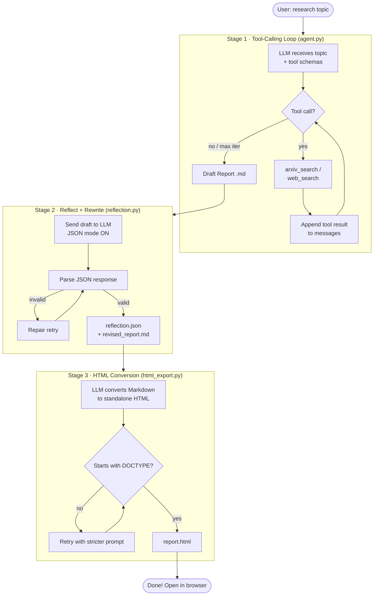

# 🔬 Reflective Research Agent

[](https://www.python.org/)
[](LICENSE)
[](https://platform.deepseek.com)
[](https://arxiv.org/)
[](tests/)

A command-line agentic-AI tool that takes a **research topic**, gathers sources using
**LLM tool-calling** (arXiv + web search), writes a comprehensive research report,
**reflects on and rewrites** the report, then exports the final result as a clean,
standalone **HTML file** — all powered by the DeepSeek API.

---

## ✨ Features

- 🔍 **Stage 1 – Tool-calling research loop**: The LLM autonomously calls `arxiv_search`
  and `web_search` tools, accumulates evidence, and writes a cited draft report.
- 🪞 **Stage 2 – Reflection + rewrite**: A second LLM pass critiques the draft (strengths,
  weaknesses, suggestions) and produces an improved version, returned as structured JSON.
- 🌐 **Stage 3 – HTML export**: The revised report is converted to a beautiful,
  self-contained HTML file with inline CSS, dark-mode support, and clickable citations.
- ⚡ **DeepSeek V4 Flash**: Fast, cost-effective reasoning with thinking mode disabled
  by default for maximum speed.
- 🔄 **Automatic fallback**: Uses Tavily for web search when a key is available;
  falls back seamlessly to DuckDuckGo (no key required).
- 🛡️ **Robust error handling**: Exponential backoff on 429/5xx, clear messages for
  401/402, JSON repair retry for malformed LLM output.
- 📁 **Organised output**: All artefacts saved to a timestamped folder per run.

---

## 🗺️ How It Works



---

## 📦 Installation

### Prerequisites

- Python 3.10 or newer
- A [DeepSeek API key](https://platform.deepseek.com) (free tier available)
- Optional: A [Tavily API key](https://tavily.com) for higher-quality web search

### Steps

```bash
# 1. Clone the repository
git clone https://github.com/yourusername/reflective-research-agent.git
cd reflective-research-agent

# 2. Create and activate a virtual environment
python -m venv .venv

# On Windows:
.venv\Scripts\activate
# On macOS / Linux:
source .venv/bin/activate

# 3. Install the package (editable mode installs the 'research-agent' CLI)
pip install -e .

# 4. Or install from requirements.txt (for development)
pip install -r requirements.txt
pip install -e .
```

---

## 🔑 Getting API Keys

### DeepSeek API Key (required)

1. Go to [platform.deepseek.com](https://platform.deepseek.com)
2. Sign up or log in
3. Navigate to **API Keys** in the dashboard
4. Click **Create new key** and copy it

> **Pricing**: DeepSeek V4 Flash is very affordable. A typical full research run
> (all 3 stages) costs approximately $0.01–0.05 USD.

### Tavily API Key (optional but recommended)

1. Go to [tavily.com](https://tavily.com)
2. Sign up for a free account (1,000 free searches/month)
3. Copy your API key from the dashboard

> If `TAVILY_API_KEY` is not set, the agent automatically falls back to
> DuckDuckGo — no key needed.

---

## ⚙️ Configuration

Copy the example env file and fill in your keys:

```bash
cp .env.example .env
```

Then edit `.env`:

```dotenv
# Required
DEEPSEEK_API_KEY=sk-xxxxxxxxxxxxxxxxxxxx

# Optional overrides (shown with defaults)
DEEPSEEK_MODEL=deepseek-v4-flash
DEEPSEEK_THINKING=disabled    # or "enabled" for chain-of-thought
TAVILY_API_KEY=tvly-xxxx      # leave blank to use DuckDuckGo
OUTPUT_DIR=outputs
MAX_ITERATIONS=6
```

> ⚠️ **Never commit your `.env` file.** It is listed in `.gitignore` by default.

---

## 🚀 Usage

### Basic usage

```bash
research-agent "quantum computing applications in cryptography"
```

### With options

```bash
# Use a specific model and more research iterations
research-agent "CRISPR gene editing ethics" \
  --model deepseek-v4-flash \
  --max-iterations 8

# Custom output directory + open in browser when done
research-agent "large language model alignment" \
  --output-dir ./my-reports \
  --open

# Verbose mode (shows tool arguments, raw LLM responses)
research-agent "fusion energy breakthroughs" --verbose
```

### Run as a module (no install required)

```bash
python -m reflective_agent "transformer neural networks"
```

---

## 📋 CLI Options

| Flag | Default | Description |
|------|---------|-------------|
| `TOPIC` | *(required)* | Research topic (quote if multi-word) |
| `--model MODEL` | `deepseek-v4-flash` | DeepSeek model name |
| `--max-iterations N` | `6` | Max tool-calling rounds in Stage 1 |
| `--output-dir DIR` | `outputs` | Base directory for output files |
| `--save-json` | off | Explicitly flag to save reflection JSON (always saved) |
| `--open` | off | Open HTML report in default browser after completion |
| `--verbose` | off | Enable debug logging (tool args, raw responses) |

---

## 📂 Output Files

Each run creates a timestamped folder: `outputs/<topic-slug>-<YYYYMMDD-HHMMSS>/`

| File | Stage | Description |
|------|-------|-------------|
| `draft.md` | 1 | Raw first-pass Markdown report from the research agent |
| `reflection.json` | 2 | Structured JSON: strengths, weaknesses, suggestions + revised text |
| `final_report.md` | 2 | Improved Markdown report (post-reflection rewrite) |
| `report.html` | 3 | Self-contained HTML — open in any browser, no dependencies |

---

## 🌐 Live HTML Preview

A sample report is available in [`docs/index.html`](docs/index.html).

### 👁️ View on GitHub Pages

**Step 1:** Push your repository to GitHub.

**Step 2:** Go to **Settings → Pages → Build and deployment**:
- Source: **Deploy from a branch**
- Branch: `main` → `/docs`
- Click **Save**

**Step 3:** After ~60 seconds your report is live at:

```
https://<your-github-username>.github.io/reflective-research-agent/
```

### Alternative: htmlpreview.github.io

If you haven't set up GitHub Pages yet, use this fallback link:

```
https://htmlpreview.github.io/?https://github.com/<username>/reflective-research-agent/blob/main/docs/index.html
```

---

## 📁 Project Structure

```
reflective-research-agent/
├── src/reflective_agent/
│   ├── __init__.py        # Package metadata
│   ├── __main__.py        # python -m reflective_agent
│   ├── cli.py             # argparse entry point; orchestrates pipeline
│   ├── agent.py           # Stage 1: tool-calling research loop
│   ├── reflection.py      # Stage 2: reflect + rewrite (JSON output)
│   ├── html_export.py     # Stage 3: HTML conversion with validation
│   ├── tools.py           # arxiv_search, web_search, schemas, dispatcher
│   ├── llm.py             # DeepSeek client wrapper (retries, thinking)
│   └── config.py          # Environment variable loading
├── tests/
│   ├── conftest.py        # Shared fixtures
│   ├── test_json_parsing.py
│   ├── test_tools.py
│   ├── test_html_validation.py
│   ├── test_cli.py
│   └── test_llm.py
├── examples/
│   ├── README.md          # Sample run description
│   └── reflection.json    # Pre-generated reflection example
├── docs/
│   └── index.html         # Sample HTML report (GitHub Pages)
├── outputs/               # Generated reports (git-ignored)
├── .env.example           # Template for environment variables
├── .gitignore
├── requirements.txt
├── pyproject.toml         # Package config + console script
├── LICENSE                # MIT
└── README.md
```

---

## 🧪 Running Tests

```bash
# Run the full test suite
pytest

# With coverage report
pytest --cov=reflective_agent --cov-report=term-missing

# Run a specific test file
pytest tests/test_json_parsing.py -v
```

All tests use mocked LLM clients and mocked tool functions — **no real API calls** are made during testing.

---

## ⚠️ Limitations

- **Hallucination risk**: Like all LLM-generated content, reports may contain inaccuracies.
  Always verify key claims against the cited sources.
- **Search quality**: DuckDuckGo fallback may return lower-quality snippets than Tavily.
  For best results, set `TAVILY_API_KEY`.
- **arXiv coverage**: Excellent for computer science, physics, and mathematics; weaker for
  humanities or very recent news.
- **Token costs**: Very long topics or high `--max-iterations` values increase API costs.
- **Rate limits**: Free-tier DeepSeek keys have rate limits; the agent retries with
  exponential backoff but may still fail on sustained heavy use.

---

## 🗺️ Roadmap

- [ ] Support additional LLM providers (OpenAI, Anthropic, Ollama)
- [ ] Add a PDF export stage (via WeasyPrint or Playwright)
- [ ] Streaming output during Stage 1 for live progress display
- [ ] Interactive mode: ask follow-up questions about the generated report
- [ ] Configurable citation styles (APA, MLA, Chicago)
- [ ] Docker image for zero-setup deployment

---

## 🙏 Acknowledgements

> Inspired by concepts from the **Agentic AI** course by Andrew Ng
> ([DeepLearning.AI on Coursera](https://www.coursera.org/learn/agentic-ai)).
> All code in this repository is my own implementation.

Special thanks to:
- [DeepSeek](https://deepseek.com) for the fast, affordable API
- [arXiv](https://arxiv.org) for open-access academic research
- [Tavily](https://tavily.com) for research-quality web search
- The [duckduckgo-search](https://github.com/deedy5/duckduckgo_search) project for the no-key fallback

---

## 📄 License

[MIT](LICENSE) © 2026 Reflective Research Agent Contributors
